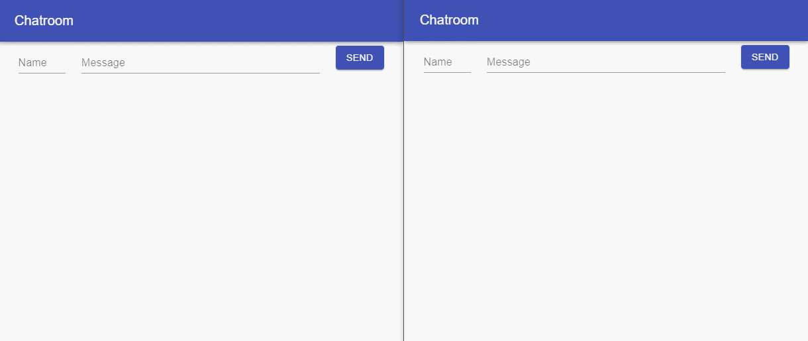

grpc-web-chat
====

This is a test app that chats in real time.



## Dependencies
- grpc
- grpc-web
- envoy
- redis
- grpc-web-chat-front(https://github.com/ksmt88/grpc-web-chat-front)

## Getting Started
```bash
docker-compose up
```

## Kubernetes
- Modify envoy.yaml
```
hosts: [{ socket_address: { address: 127.0.0.1, port_value: 50051 }}]
```
- create ingress, service...etc
```
kubectl apply -f ./k8s/
```

